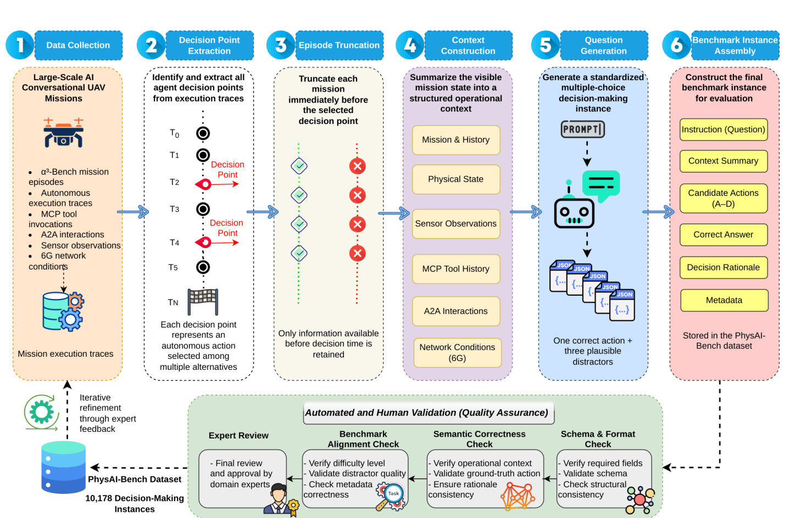
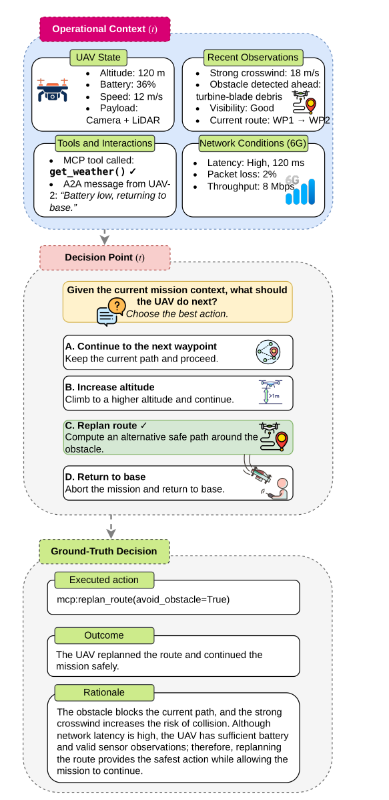
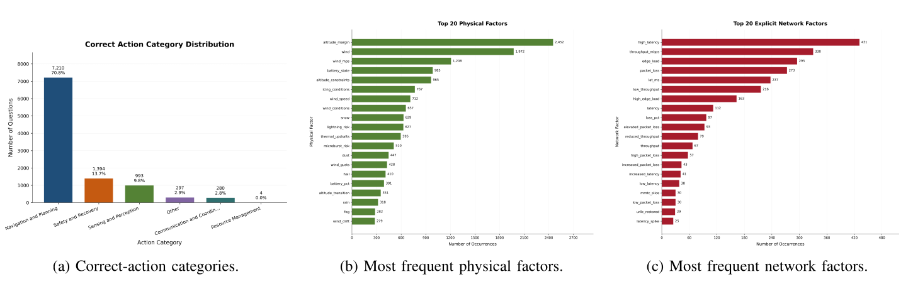
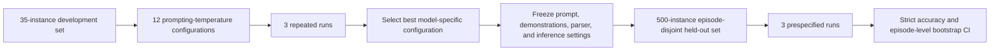
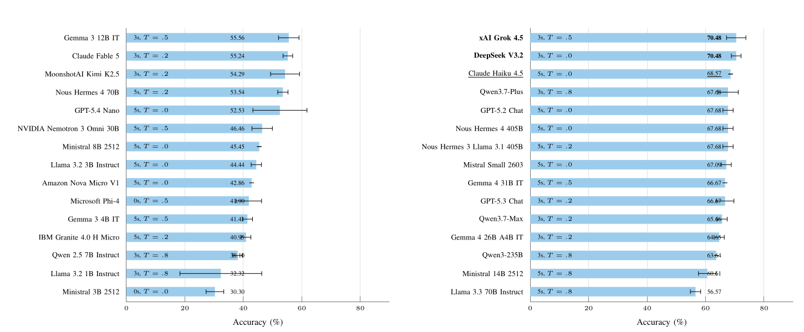
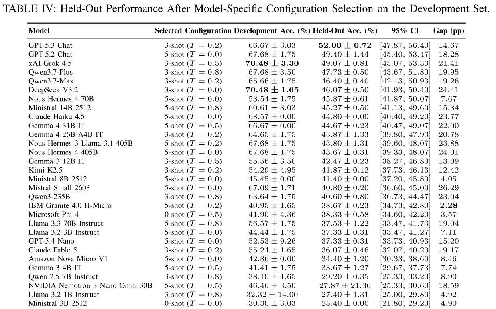
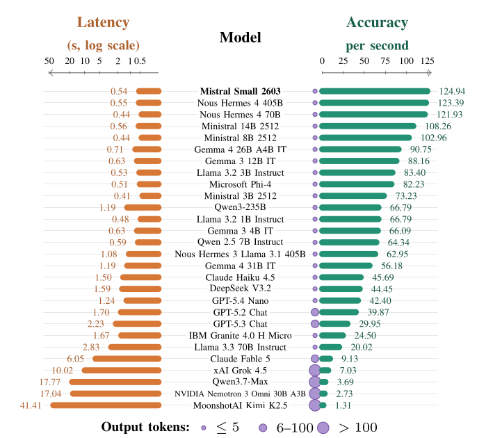

<div align="center">

# PhysAI-Bench

### A Benchmark for LLM-Based Agentic Decision-Making in Autonomous UAV-Centric Physical AI

**Physical AI · Agentic Decision-Making · Autonomous UAVs · MCP/A2A · AI-Native 6G**

[Paper](paper/physai-bench.pdf) · [Benchmark](#benchmark-at-a-glance) · [Results](#main-results) · [Citation](#citation) · [Contact](#contact)

</div>

---

## Overview

**PhysAI-Bench** evaluates whether foundation models can choose the most appropriate next action for an autonomous Physical AI agent. It converts large-scale conversational UAV mission traces into standardized multiple-choice decision problems that preserve the information available at decision time while excluding future events.

Each instance captures mission objectives, temporal dependencies, physical constraints, sensor observations, Model Context Protocol (MCP) tool calls, Agent-to-Agent (A2A) interactions, and AI-native 6G network conditions. This isolates context-aware action selection from downstream execution reliability and approximates online autonomous decision-making without future-information leakage.

<p align="center">
  
</p>

<p align="center"><sub><b>Figure 1.</b> End-to-end construction and validation workflow. Conversational UAV mission traces are converted into multiple-choice decision instances through decision-point extraction, episode truncation, context construction, question generation, automated validation, and expert review.</sub></p>

## Benchmark at a glance

| | |
|---|---:|
| Decision-making instances | **10,178** |
| Candidate actions per instance | **4** |
| Human-verified development set | **35 instances** |
| Episode-disjoint held-out set | **500 instances** |
| Evaluated foundation models | **29** |
| AI organizations represented | **14** |
| Prompting-temperature configurations | **12 per model** |
| Repeated runs | **3 per configuration** |

### What an instance contains

| Component | Information exposed to the model |
|---|---|
| Mission context | Objectives, constraints, and visible history |
| Physical state | UAV state, environment, and operational conditions |
| Observations | Sensor feedback available before the decision |
| Tools | Visible MCP calls and responses |
| Coordination | A2A messages and collaborative tasks |
| Network state | Latency, packet loss, throughput, edge load, and slicing |
| Decision | Four plausible candidate actions labeled A-D |

<p align="center">
  
</p>

<p align="center"><sub><b>Figure 2.</b> Structure of a representative PhysAI-Bench decision instance. The model receives only the mission information available before the selected decision and chooses one of four candidate actions.</sub></p>

The reference answer is the action executed in the original autonomous mission trace. It is not presented as the only theoretically valid or globally optimal action.

## Construction principles

1. **Trace-derived decisions.** Every instance originates from an autonomous action selected during mission execution.
2. **Strict temporal truncation.** The source episode is cut immediately before the target action.
3. **Answer-blind generation.** Context summaries and distractor candidates are generated without access to the executed action.
4. **Independent assembly.** The trace-derived action is introduced only after the context and candidate pool are frozen.
5. **Automated validation.** Schema, format, semantic consistency, and distractor quality are checked programmatically.
6. **Expert quality assurance.** Domain experts review the resulting benchmark and refine the generation process.

## Composition and coverage

The correct answer is nearly uniform across candidate positions: A, B, C, and D represent 24.8%, 25.0%, 25.3%, and 24.9% of instances, respectively. This limits answer-position bias.

<p align="center">
  
</p>

<p align="center"><sub><b>Figure 3.</b> Benchmark composition and operating-condition coverage: correct-action categories, physical factors, and explicit network factors.</sub></p>

| Action category | Instances | Share |
|---|---:|---:|
| Navigation and planning | 7,210 | 70.8% |
| Safety and recovery | 1,394 | 13.7% |
| Sensing and perception | 993 | 9.8% |
| Other | 297 | 2.9% |
| Communication and coordination | 280 | 2.8% |
| Resource management | 4 | <0.1% |

Frequently represented physical factors include altitude margin, wind, wind speed, battery state, and altitude constraints. Network contexts include high latency, throughput, edge-computing load, packet loss, and measured latency.

## Evaluation protocol

PhysAI-Bench separates configuration selection from final performance estimation.



Development evaluates the Cartesian product of:

- prompting: **0-shot, 3-shot, and 5-shot**;
- temperature: **0.0, 0.2, 0.5, and 0.8**.

Ties are resolved using lower run-to-run variability, lower inference latency, lower temperature, and fewer demonstrations, in that order. Development and demonstration source episodes are excluded from held-out evaluation. Missing, malformed, and failed predictions count as incorrect.

<p align="center">
  
</p>

<p align="center"><sub><b>Figure 4.</b> Model-specific configuration selection on the 35-instance human-verified development set. Bars show mean accuracy over three runs; whiskers show one standard deviation.</sub></p>

## Main results

GPT-5.3 Chat obtains the highest held-out decision accuracy at **52.00%**, followed by GPT-5.2 Chat at **49.40%** and xAI Grok 4.5 at **49.07%**.

| Rank | Model | Selected configuration | Development accuracy | Held-out accuracy |
|---:|---|---|---:|---:|
| 1 | **GPT-5.3 Chat** | 3-shot, T = 0.2 | 66.67 ± 3.03% | **52.00 ± 0.72%** |
| 2 | **GPT-5.2 Chat** | 5-shot, T = 0.0 | 67.68 ± 1.75% | **49.40 ± 1.44%** |
| 3 | **xAI Grok 4.5** | 3-shot, T = 0.5 | 70.48 ± 3.30% | **49.07 ± 0.81%** |
| 4 | Qwen3.7-Plus | 3-shot, T = 0.8 | 67.68 ± 3.50% | 47.73 ± 0.50% |
| 5 | Qwen3.7-Max | 3-shot, T = 0.2 | 65.66 ± 1.75% | 46.40 ± 0.40% |

<p align="center">
  
</p>

<p align="center"><sub><b>Table IV.</b> Held-out performance after model-specific configuration selection. Confidence intervals use bootstrap resampling of complete source episodes.</sub></p>

### Key findings

- The best held-out accuracy is only **52.00%**, demonstrating that reliable decision-making under coupled physical, operational, and network constraints remains difficult.
- Few-shot prompting generally improves development-stage performance, but the size of the gain is highly model-dependent.
- Decoding temperature has comparatively limited influence for the strongest reasoning models.
- Development accuracy can substantially overestimate generalization; every evaluated model has a positive development-to-held-out gap.
- Parameter count alone does not determine performance. Reasoning ability, instruction following, agent-oriented behavior, and output reliability matter substantially.

## Efficiency and reliability

High decision accuracy does not necessarily imply efficient inference. Several compact and medium-scale open-weight models offer a stronger balance of accuracy, latency, and output reliability than much larger frontier models.

<p align="center">
  
</p>

<p align="center"><sub><b>Figure 7.</b> Accuracy-latency trade-offs for model-provider configurations selected on the development set. Marker size represents average output length.</sub></p>

Mistral Small 2603 achieves the highest development-stage Accuracy/Second score at **124.94**, followed by Nous Hermes 4 405B at **123.39** and Nous Hermes 4 70B at **121.93**.

## Limitations and future work

- The current benchmark is instantiated from autonomous UAV missions.
- Decision contexts use structured text rather than raw images, video, LiDAR, audio, or other sensor modalities.
- Evaluation focuses on high-level action selection rather than low-level perception or end-to-end task completion.
- Trace-derived actions are operational references, not proofs of global optimality.

Future work will extend PhysAI-Bench to robotics, autonomous driving, embodied assistants, industrial automation, richer multimodal observations, more diverse environments, and broader multi-agent scenarios.

## Release status

| Artifact | Status |
|---|---|
| Paper | Included in this repository |
| Benchmark schema and illustrative example | Included |
| Full 10,178-instance dataset | Release pending |
| Locked development and held-out manifests | Release pending |
| Generation and evaluation code | Release pending |
| Model outputs and frozen configurations | Release pending |

Release links will be added after the canonical artifacts, fingerprints, split membership, provenance, and licenses are finalized.

## Citation

If you use PhysAI-Bench, please cite:

```bibtex
@article{ferrag2026physaibench,
  title  = {PhysAI-Bench: A Benchmark for LLM-Based Agentic Decision-Making in Autonomous UAV-Centric Physical AI},
  author = {Ferrag, Mohamed Amine and Debbah, Merouane and Lakas, Abderrahmane and Perumkunnil, Manu and Tihanyi, Norbert},
  year   = {2026}
}
```

## Authors

- **Mohamed Amine Ferrag** - United Arab Emirates University
- **Merouane Debbah** - Khalifa University
- **Abderrahmane Lakas** - United Arab Emirates University
- **Manu Perumkunnil** - Interuniversity Microelectronics Centre (IMEC)
- **Norbert Tihanyi** - Technology Innovation Institute

## Contact

Questions about PhysAI-Bench can be directed to **Mohamed Amine Ferrag** at `mohamed.ferrag@uaeu.ac.ae`.

